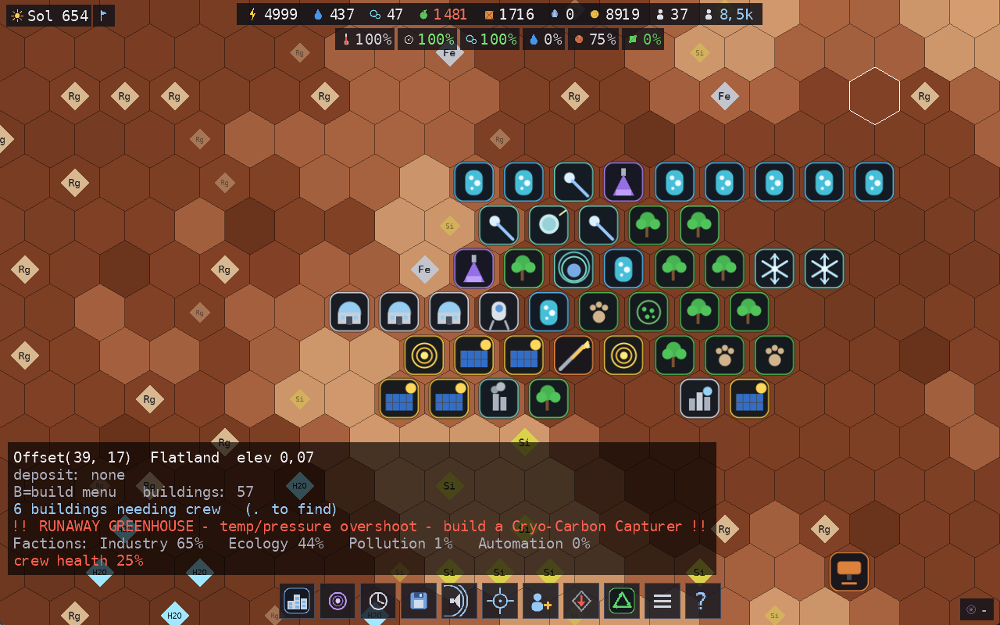
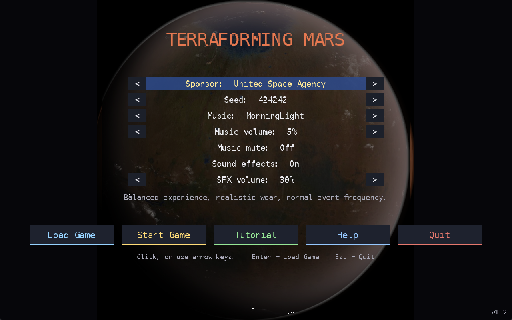
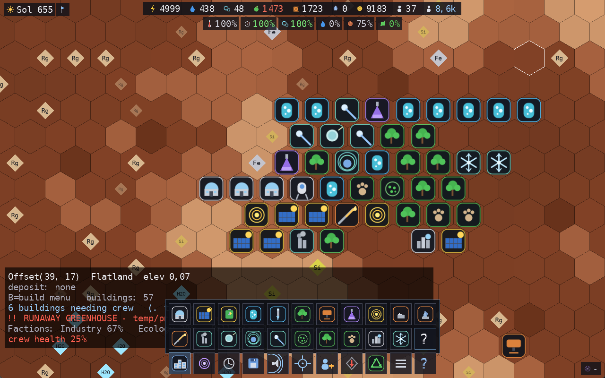
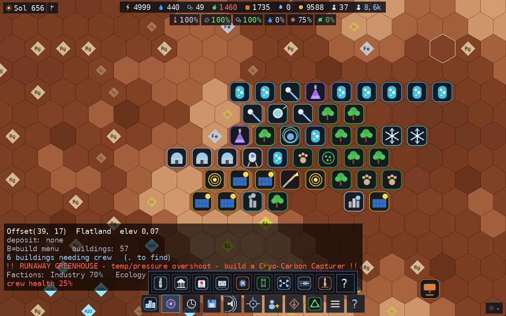
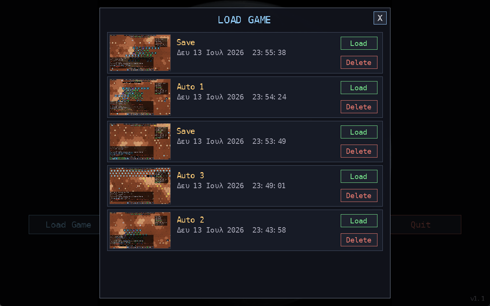

# 🔴 Terraforming Mars

[🇬🇧 English](README.md) · **🇬🇷 Ελληνικά**

**Χτίσε μια αποικία στον Άρη. Μετά κάνε τον Άρη κατοικήσιμο. Μετά κράτησέ τον έτσι.**

Open-source base-building / simulation παιχνίδι σε **C# / .NET 9 + MonoGame**, με procedurally-generated
hex χάρτη και real-time προσομοίωση. Ξεκινάς με μια κάψουλα προσεδάφισης, τέσσερις αποίκους και έναν
νεκρό, παγωμένο πλανήτη. Εξορύσσεις, χτίζεις, ερευνάς — και σιγά σιγά ανεβάζεις θερμοκρασία, πίεση,
οξυγόνο και νερό, μέχρι ο πάγος να λιώσει σε θάλασσες και η βλάστηση να απλωθεί στις πεδιάδες.

Και τότε αρχίζει το δεύτερο μισό: ένας **ζωντανός πλανήτης** που σου αντιστέκεται.



---

## 📸 Screenshots

| | |
|---|---|
|  <br> **Κεντρικό μενού** — χορηγός, seed, μουσική· ο πλανήτης στο φόντο περνά από όλα τα στάδια του terraforming |  <br> **Παλέτα κτιρίων** — 33 κτίρια, το καθένα με δικό του διανυσματικό εικονίδιο |
|  <br> **Δέντρο έρευνας** — 23 τεχνολογίες, οι 10 ξεκλειδώνουν μόνο **μετά** το terraforming |  <br> **Load Game** — πολλαπλά saves με screenshot, ημερομηνία & 3 κυκλικά autosaves |

---

## ✨ Τι έχει το παιχνίδι

### Φάση 1 — Το Terraforming

* **Procedural hex χάρτης** (Perlin/fBm) με υψόμετρα, terrain και κοιτάσματα (πάγος, σίδηρος, πυρίτιο, regolith).
* **Οικονομία & πληθυσμός:** εξόρυξη, παραγωγή, brownout όταν δεν φτάνει η ενέργεια, life-support που σκοτώνει το πλήρωμα αν το αμελήσεις. Νέοι άποικοι έρχονται όταν υπάρχει στέγαση + τροφή.
* **Ειδικότητες:** Geologist, Engineer, Botanist, Climatologist, Doctor — ο σωστός άνθρωπος στο σωστό κτίριο δίνει +50% απόδοση.
* **Τέσσερις πλανητικές μετρικές** (θερμοκρασία, πίεση, O₂, νερό). Ο πάγος λιώνει σε θάλασσες, η βλάστηση απλώνεται, ο χάρτης αλλάζει μπροστά σου.
* **Γεγονότα:** αμμοθύελλες (κόβουν την ηλιακή ενέργεια), ηλιακές εκλάμψεις, βλάβες life-support, ανακάλυψη σπηλαίων.
* **Χορηγοί** (Easy / Normal / Hard) που αλλάζουν αρχικά κεφάλαια, στέγαση, συχνότητα γεγονότων και ταχύτητα επισκευών.
* **Εμπόριο:** πούλα πλεόνασμα πυριτίου στη Γη με Mass Driver για να χρηματοδοτήσεις τα megaprojects.

**Νίκη** όταν και οι 4 μετρικές φτάσουν τους στόχους. Αλλά η νίκη δεν είναι το τέλος…

### Φάση 2 — The Living Planet 🌍

Μόλις ολοκληρωθεί το terraforming, ξεκλειδώνουν **2 νέες βαθμίδες τεχνολογίας (10 τεχνολογίες,
12 κτίρια)** και ο πλανήτης παύει να είναι παθητικός στόχος — γίνεται σύστημα που πρέπει να **συντηρείς**.
Ο πληθυσμός εκτοξεύεται από δεκάδες αποίκους σε **δεκάδες χιλιάδες** κατοίκους.

| Σύστημα | Τι συμβαίνει | Η απάντησή σου |
|---|---|---|
| 🔥 **Runaway Greenhouse** | Τα εργοστάσια που σε έφεραν στη νίκη συνεχίζουν να δουλεύουν — θερμοκρασία & πίεση ξεπερνούν τον στόχο, οι ωκεανοί εξατμίζονται, το πλήρωμα αρρωσταίνει | **Cryo-Carbon Capturer** |
| 🏙️ **Urbanization** | Κύματα μεταναστών από τη Γη· αν ξεπεράσουν τη στέγαση → *systemic stagnation* και η παραγωγή πέφτει | **High-Density Arcology** |
| ⚖️ **Faction Politics** | Βιομήχανοι vs Οικολόγοι. Χαμηλή έγκριση = **απεργία** (ορυχεία ή βιόσφαιρα σταματούν) | **District Town Hall** |
| 🏭 **Pollution** | Η βαριά βιομηχανία μολύνει τα hexes· η βλάστηση γύρω μαραίνεται | **Atmospheric Scrubber** |
| 💹 **Silicon Monopoly** | Σταμάτα να πουλάς φτηνό πυρίτιο — μεταποίησέ το | **Quantum Processor Plant**, **Interplanetary Stock Exchange** |
| 🌋 **Deep Core Extraction** | Άπειρα μέταλλα από τον μανδύα — με τίμημα **σεισμική αστάθεια** και marsquakes που ραγίζουν κτίρια | Άπλωσε τα **Deep Core Drills** |
| 🤖 **Advanced Automation** | Τα drones τρέχουν τη βαριά βιομηχανία χωρίς ανθρώπους | **AI Drone Hive** |
| 🌀 **Extreme Weather** | Πυκνός αέρας + ωκεανοί = **super-storms**. Οι τυφώνες σαρώνουν τα ηλιακά και πλημμυρίζουν τα χαμηλά | **Sea Wall** |
| 🐛 **Invasive Species** | Παράσιτα από τη Γη τρώνε σοδειές και μαραίνουν βλάστηση | **Genetic Vault**, Wildlife Reserves |
| 🚄 **Hyperloop Network** | Τα μακρινά ορυχεία δουλεύουν στη μισή απόδοση — και αν ένας κόμβος σπάσει από τυφώνα, **blackout** | Αλυσίδα από **Hyperloop Terminals** |
| ☣️ **The Martian Plague** | Στον υδάτινο πλέον πλανήτη ανθίζουν μεταλλαγμένα παθογόνα· το εργατικό δυναμικό αρρωσταίνει | **Isolation Hospital** στελεχωμένο με **Doctors** |

### Quality of life

* **Tutorial wizard** βήμα-βήμα (προχωράει μόνο του καθώς εκτελείς τις ενέργειες· Esc για έξοδο).
* **Πολλαπλά saves** σε φάκελο `SavedGames`, το καθένα με **screenshot**, όνομα και ημερομηνία — λίστα με scroll, μεγάλο preview, επιβεβαίωση στο Delete.
* **3 κυκλικά autosaves** (Auto 1/2/3) κάθε 5 λεπτά.
* **In-game help** για κάθε κτίριο και κάθε τεχνολογία, σε παράθυρο με scroll.
* **HUD μετρητές** για κτίρια χωρίς προσωπικό ή με εξαντλημένο κοίτασμα (με κουμπί «βρες το επόμενο»).
* **Ήχος & μουσική** (OGG), mute με ένα κλικ.

---

## 🛠 Stack

* **.NET 9** — καθαρό domain layer, εντελώς ανεξάρτητο από engine
* **MonoGame (DesktopGL)** για rendering/input — τα εικονίδια παράγονται **προγραμματιστικά** (CPU rasterizer με anti-aliasing), χωρίς αρχεία assets
* Hex grid (pointy-top, axial/cube), procedural generation με Perlin noise (fBm + quantile classification)
* Fixed-timestep προσομοίωση (pause / ×1 / ×2 / ×4) — **1 tick = 1 ώρα**, 24 ώρες = 1 Sol
* **Data-driven**: κτίρια, τεχνολογίες και χορηγοί ορίζονται σε JSON — προσθέτεις κτίριο χωρίς να αγγίξεις κώδικα
* **191 unit tests** (xUnit)

## 📁 Δομή Solution

```
src/TerraformingMars.Core   — domain & simulation (engine-agnostic)
    Grid/        Hex, OffsetCoord, HexLayout
    Map/         TerrainType, ResourceType, ResourceDeposit, HexTile, HexMap
    Generation/  INoiseSource, PerlinNoise, MapGenerator, MapGenerationSettings
    Simulation/  World, Colony, GameClock, ResourceLedger + 19 simulation systems:
                 Construction · Production · Market · Research · Planet · Biosphere ·
                 Population · LifeSupport · Event
                 ── Φάση 2 ──
                 Phase2 (runaway) · Society (πληθυσμός) · Faction (πολιτική) ·
                 Pollution · Seismic · Automation · Weather · Ecosystem ·
                 Hyperloop (logistics) · Plague
    Buildings/   BuildingDefinition, BuildingCatalog, Building
    Colonists/   Specialty, Colonist
    Research/    TechDefinition, TechCatalog, TechTree
    Planet/      PlanetMetric, PlanetState (μετρικές terraforming)
    Events/      EventType, SponsorProfile, SponsorCatalog
    Persistence/ SaveSystem, SaveGame (JSON save/load)
    Data/        buildings.json (33) · technologies.json (23) · sponsors.json (3)

src/TerraformingMars.Game   — MonoGame: Camera2D, HexMapRenderer, IconFactory,
                              AudioManager + MusicPlayer, SaveManager, MarsGame

tests/TerraformingMars.Core.Tests — xUnit (191 tests)
```

## ▶ Build & Run

```bash
dotnet test                                    # 191 unit tests
dotnet run --project src/TerraformingMars.Game # το παιχνίδι
```

> **Linux:** για ήχο χρειάζεται το system OpenAL — `sudo apt install libopenal1` (το bundled libopenal
> του MonoGame θέλει νεότερο glibc). Η μουσική είναι OGG (cross-platform μέσω `MediaPlayer`) και το HUD
> font είναι bundled DejaVu Sans Mono.

## ⌨ Controls

Το UI είναι κυρίως με το **ποντίκι**: μια μπάρα εργαλείων κάτω + εικονίδια κατάστασης στις γωνίες.

**Μενού:** *Load Game* · *Start Game* · **Tutorial** · *Help* · *Quit* — κλικ ή βελάκια + Enter.
Ρυθμίσεις (χορηγός, seed, μουσική, εντάσεις) με κλικ/βελάκια· **R** = τυχαίο seed.

**Μπάρα εργαλείων (κάτω):**

| Κουμπί | Δράση |
|---|---|
| Κτίρια | παλέτα (2 σειρές) → διάλεξε κτίριο → κλικ σε hex = τοποθέτηση · **?** = help όλων των κτιρίων |
| Έρευνα | λίστα διαθέσιμων τεχνολογιών → κλικ = επιλογή · **?** = help όλων των τεχνολογιών |
| Ταχύτητα (ρολόι) | pause / ×1 / ×2 / ×4 |
| Save (δισκέτα) | αποθήκευση (με screenshot) |
| Mute (ηχείο) | mute/unmute |
| Κεντράρισμα | επιστροφή κάμερας στην κάψουλα (**H**) |
| Προσωπικό · Κοίτασμα | μετρητές κτιρίων που χρειάζονται εργάτες / έχουν εξαντληθεί — κλικ = πήγαινε στο επόμενο |
| Reclaim | (αφού ερευνηθεί) ανακύκλωση κτιρίου για credits & υλικά |
| Menu · ? | πίσω στο μενού · βοήθεια |

**Ποντίκι & πλήκτρα:**

| | Δράση |
|---|---|
| drag (αριστερό/μεσαίο) · ροδέλα | pan · zoom |
| WASD / βελάκια | κίνηση κάμερας |
| δεξί κλικ | επιλογή hex/κτιρίου (ή ακύρωση build/popup) |
| **[−] / [+]** στο panel κτιρίου, ή **+ / −** | ανάθεση/αφαίρεση αποίκου |
| Space · 1 / 2 / 3 | pause · ταχύτητα ×1 / ×2 / ×4 |
| B · T · H | παλέτα κτιρίων · έρευνα · κεντράρισμα |
| F5 · F9 | save · load |
| U · Esc | mute · πίσω στο μενού |

**HUD:** πάνω-αριστερά **Sol & χορηγός**· πάνω-κέντρο η **μπάρα πόρων** (κοκκινίζει όταν πέφτει, hover =
όριο & μεταβολή/tick)· από κάτω οι **4 στόχοι + terraforming % + biomass**· κάτω-δεξιά η **πρόοδος έρευνας**·
κάτω-αριστερά panel με tile/κτίριο, **alerts** και γεγονότα. Στη Φάση 2 προστίθενται ο **πληθυσμός**,
οι **παρατάξεις**, η **ρύπανση**, η **αυτοματοποίηση** και προειδοποιήσεις (runaway, marsquake, super-storm,
εισβλητικά είδη, πανώλη, logistics blackout).

---

## 📖 Περισσότερα

Αναλυτικός, μη-τεχνικός οδηγός του gameplay: **[GAMEPLAY.el.md](GAMEPLAY.el.md)**

## Άδεια

[MIT](LICENSE)
